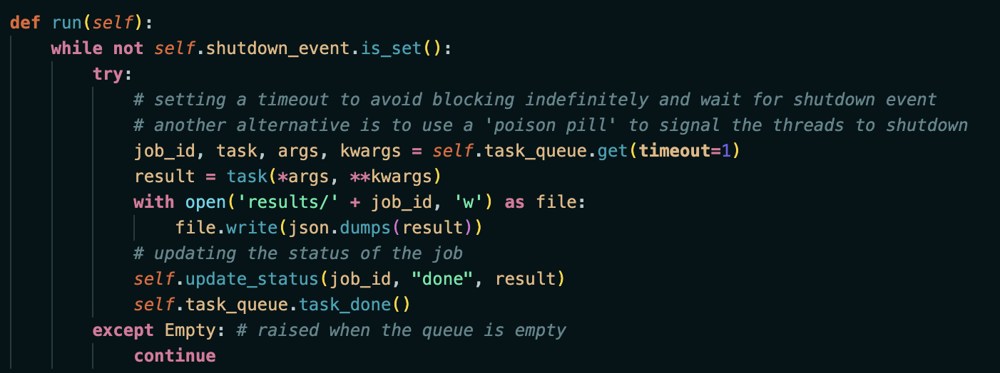

# ASC - project 
## Dumitrescu Rares Matei - 331CA

## Organization And Overview

In this project I implemented a Flask based webserver which is designed to provide insights into health statistics across various locations. It utilizes a CSV dataset to perform data analysis operations such as calculating means, best and worst states, and other statistical measures. The server is asynchronous, handling data processing tasks in a thread pool, allowing for non-blocking operations and a responsive API.

### Features
 - data_ingestor.py: Processes a CSV file containing health statistics for analysis.
 - task_runner.py: Uses a thread pool to manage long-running data processing tasks without blocking the main thread.
 - routes.py: Offers a suite of API endpoints to submit data processing jobs and retrieve results.
 - logger_config.py: Implements a custom logger to record server operations with UTC timestamps.

### General Approach
ThreadPool Class:
- add_task method: this method adds a new task to the queue to be executed by the thread pool. It assigns a unique job ID to each task, records its status as 'running', and places it into the task queue

- update_job_status method: it updates the status of a task using the job ID. If a result is provided, it's stored alongside the status

- graceful_shutdown method: this method triggers the shutdown process, ensuring that all worker threads are finished before completely shutting down the thread pool

TaskRunner Class:
- run method: this method, continuously processes tasks from the queue until the shutdown event is set. For each task, it executes the given function with arguments, saves the result to a file, and updates the task's status as 'done'. If the queue is empty, it waits for a short time before trying again

#### Important Parameters And Their Roles
- Queue: it is used to store tasks that need to be executed by worker threads. Tasks are enqueued and dequeued in a thread-safe manner.

- Empty: this exception is raised when attempting to get an item from an empty queue.

- Event: it is a synchronization primitive that is used to signal that something has happened. Here, it's used to signal worker threads to stop running (another alternative is to use a 'poison pill' and adding None workers)

- Lock: this is another synchronization primitive used to prevent multiple threads from accessing a resource at the same time, preventing race conditions

These are the most important steps in implementing the project, since the api calls are simple calculations based on the dataset.

Some modules used for manipulating the data are *pandas*, *json*, *csv*.

A logger is also implemented in app.config.logger.py for checking if api calls returns are as expected.

-------------------------------------

Implementing this project was very exciting. I think it is my favorite one in my first 3 years of University. It envolves working with useful tasks and things that are used in SRE industry.

-------------------------------------

### Useful Resources
 - Official python documentation, stackoverflow for errors and exceptions